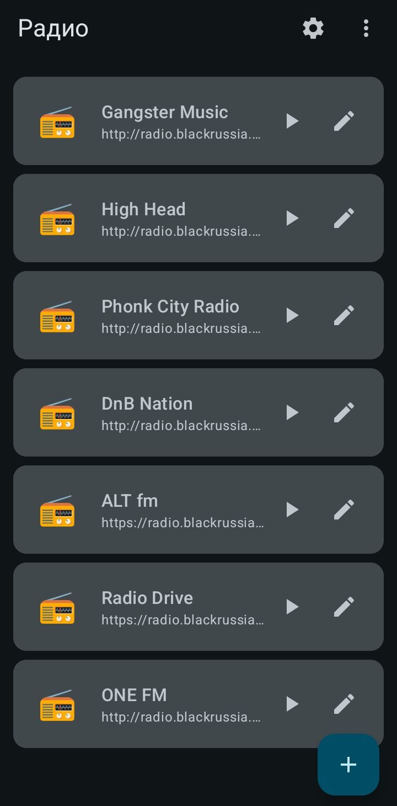

# Rplayer

**English** | [Русский](README.ru.md)

Native Android internet radio player built with **Kotlin**, **Jetpack Compose**, and **Media3**.

**Version:** 2.2 (`versionCode` 22)

<p align="center">
  
</p>

## Features

- Empty station list on first launch — add your own streams
- Add / edit stations: stream URL, name, icon (URL or file via SAF)
- Drag-and-drop reorder (long-press a station)
- Swipe to delete with confirmation
- Bulk **import / export** stations as JSON (⋮ menu)
- Background playback with media notification
- ICY / stream metadata as a scrolling “Now playing: …” line
- HTTP and HTTPS streams (invalid/expired SSL is allowed for HTTPS)
- Optional MIUI / HyperOS helpers (autostart, battery)
- Crash / playback log in app-specific external files dir (`log.txt`)
- On first run (API 33+): only `POST_NOTIFICATIONS` is requested

## Requirements

| | |
|--|--|
| minSdk | 29 (Android 10) |
| targetSdk / compileSdk | 36 (Android 16) |
| Package | `io.github.tytebyte_dev.rplayer` |

## Import / export format

```json
{
  "radio_stations": [
    { "name": "Gangster Music", "url": "http://example.com/stream" },
    { "name": "ALT fm", "url": "https://example.com/stream" }
  ]
}
```

Duplicate URLs are skipped on import.

## Build & signing

Debug and release builds use the **same** release keystore (no Android debug key).

GitHub Actions repository secrets:

| Secret | Description |
|--------|-------------|
| `KEYSTORE_BASE64` | Keystore as Base64 (`base64 -w0 release.keystore`) |
| `KEYSTORE_PASSWORD` | Keystore password |
| `KEY_ALIAS` | Key alias |
| `KEY_PASSWORD` | Key password |

Locally (same environment variables):

```bash
export KEYSTORE_BASE64="$(base64 -w0 release.keystore)"
export KEYSTORE_PASSWORD=...
export KEY_ALIAS=...
export KEY_PASSWORD=...
gradle assembleDebug   # or assembleRelease
```

## License

[PolyForm Noncommercial License 1.0.0](LICENSE) — use, modify, and redistribute **for noncommercial purposes only** (personal, hobby, education, research, nonprofits, etc.). Commercial use is not allowed.
